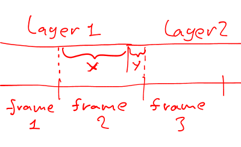

<meta name="viewport" content="width=device-width, initial-scale=1.0" />

[한국어](export-layers-plus-ko.html)

# Export Layers Plus

Yes, it's yet another export layers script!
This one is mainly targeted for video editing applications.
I wrote it because all the other scripts weren't good enough
for my purposes. 

Script is located in File/Export Layers (scm, by Timofe Shatrov)...

Features
--------

-   Can name output files based on frame counter
    (i.e. "`frame_000.png`", "`frame_001.png`" and so on)
-   Can export only visible or only linked layers
-   Correctly exports layers with layer masks
-   Can export top to bottom or bottom to top
-   Can resample to different frame rate
    (and understands frame delay modifiers i.e. "`(NNms)`")
-   Can also interpolate frames when resampling

This script was used to produce
the award winning short film *"Stretch Those Glutes (ANNIVERSARY EDITION!)"*

Options description
-------------------

-   **`Output directory`** - select a directory where to export the files
-   **`Filename format`** - describes how each layer will be named
    when it's exported.

    You can use several formatting directives:
    - "%n" inserts image name (usually the filename),
    - "`%l`" inserts layer name (don't use this with resampling enabled),
    - "%i" inserts the current counter value.

    You can pad it with zeros so that all numbers have identical width.
    For example "%3i" will produce "000", "001", "002" and so on.
    The default filename format uses "%6i"
    which produces image sequences to be imported in Sony Vegas NLE.
    Make sure your filename has an extension.
-   **`Walk direction`** - the direction in which the layers are processed.
    This mostly affects the counter.
-   **`Count offset`** - what number do we start counting from
-   **Filter** - allows to export only visible or only linked layers
-   **`Resample mode`** - when Off, it just exports the layers.
    However when "`No interpolation`" or "`Use interpolation`" is selected,
    it resamples layers to a fixed framerate.
    By default a layer is assumed to last 100ms,
    which can be changed by assigning a delay to a layer via adding "`(XXXms)`" to its name.
    When exported with resampling, each file represents a fixed amount of time,
    which is set by **`Frame rate`** option.
    For each of these periods of time, a layer is chosen to represent it.
    When "`Use interpolation`" is selected,
    it might sometimes select two layers and average them to produce a transition.
-   **`Interpolation threshold`** - when "`Resample mode`" is
    "`Use interpolation`", this option prevents interpolating
    when only a small part of layer fits into a frame. For example: 

    

    If `y` is less than interpolation threshold,
    `layer 1` will be used for `frame 2` without interpolation.
    Otherwise, `frame 2` will be an interpolation of `layer 1` and `layer 2`.
